# Minimal EMR Demo


Minimal EMR Demo is a full-stack clinical workspace built on Express and Supabase/PostgreSQL, with a companion MongoDB model for the same healthcare domain. The current implementation supports patient chart review, operational dashboards, and appointment management through a browser-based interface backed by a server-side API.

## Overview

This repository contains three related parts:

- a running web application for chart review and scheduling workflows
- a normalized PostgreSQL schema used as the live application data source
- a MongoDB document model and query set that represent the same EMR domain in a NoSQL form

The project scope is intentionally limited to a minimal EMR feature set, but it includes enough structure to show how patient, appointment, encounter, medication, allergy, lab, user, and audit data fit together.

## ERD



## Current Capabilities

- patient directory with search by name, MRN, location, and scenario text
- patient chart view with demographics, allergies, medications, labs, appointments, care team, and encounter timeline
- operational dashboard with top-level metrics, scheduled visits, and abnormal lab watchlist
- appointment scheduling workflow with create, reschedule, and cancel actions
- backend aggregation layer that assembles chart data from multiple PostgreSQL tables
- MongoDB setup, seed, and query scripts for the same EMR domain

## Architecture

### Runtime Application Path

```text
Browser frontend
    |
    v
Express API
    |
    v
Supabase / PostgreSQL
```

### Companion Modeling Path

```text
MongoDB Atlas
  |- collection validators and indexes
  |- seed documents
  `- query and aggregation scripts
```

### Main Design Choice

PostgreSQL is the runtime source for the application because the current app needs structured joins and predictable relational data access. MongoDB is included as a parallel design and query implementation for the same domain so the repository documents both normalized and document-oriented approaches.

More detail is available in `docs/architecture.md` and `docs/sql-vs-mongo.md`.

## API Summary

Current HTTP endpoints:

- `GET /api/health`
- `GET /api/dashboard`
- `GET /api/patients`
- `GET /api/doctors`
- `GET /api/patients/:patientId/chart`
- `POST /api/patients/:patientId/appointments`
- `PATCH /api/appointments/:appointmentId`

See `docs/api.md` for request and response details.

## Data Model

### PostgreSQL

The relational model includes:

- `patients`
- `doctors`
- `appointments`
- `encounters`
- `diagnoses`
- `medications`
- `allergies`
- `vitals`
- `lab_orders`
- `lab_results`
- `emr_users`
- `audit_logs`

### MongoDB

The document model includes:

- `patients`
- `doctors`
- `users`
- `appointments`
- `encounters`
- `lab_orders`
- `audit_logs`

In the MongoDB version, allergies are embedded under patients, diagnoses/vitals/medications are embedded under encounters, and lab results are embedded under lab orders.

## Local Development

### Install Dependencies

```bash
npm install
```

### Environment Variables

Copy `.env.example` to `.env` and provide the required values.

```env
PORT=3000
SUPABASE_URL=https://your-project.supabase.co
SUPABASE_ANON_KEY=your-anon-key
SUPABASE_SERVICE_ROLE_KEY=
MONGODB_ATLAS_URI=
```

Notes:

- the anon key is enough for read-only runtime access if the schema grants public reads
- the service role key is required for write workflows such as appointment creation and updates
- `.env` is intentionally ignored by git

### Run the Application

```bash
npm run dev
```

Then open:

```text
http://localhost:3000
```

If another process already uses that port, change `PORT` in `.env`.

## Database Assets

### Supabase / PostgreSQL

Run these files in the Supabase SQL editor:

1. `postgres_schema.sql`
2. `postgres_seed.sql`
3. `postgres_queries.sql`

### MongoDB / Atlas

Run these files with `mongosh`:

1. `mongo_setup.js`
2. `mongo_seed.js`
3. `mongo_queries.js`

## Seeded Scenarios

The demo dataset is organized around three patient cases:

- Elena Garcia: acute infection visit, severe penicillin allergy, antibiotic treatment, CBC review, scheduled follow-up
- Michael Johnson: hypertension and type 2 diabetes follow-up with active medications and elevated HbA1c
- Priya Nair: preventive wellness visit with elevated LDL on lipid screening

See `docs/domain-scenarios.md` for the full case descriptions.

## Project Structure

```text
.
|-- .env.example
|-- ERD.mmd
|-- ERD.svg
|-- LICENSE
|-- README.md
|-- SECURITY.md
|-- data_dictionary.md
|-- docs/
|   |-- api.md
|   |-- architecture.md
|   |-- domain-scenarios.md
|   |-- sample-results.md
|   `-- sql-vs-mongo.md
|-- frontend/
|   |-- app.js
|   |-- index.html
|   `-- styles.css
|-- mongo_queries.js
|-- mongo_seed.js
|-- mongo_setup.js
|-- package.json
|-- postgres_queries.sql
|-- postgres_schema.sql
|-- postgres_seed.sql
`-- src/
    |-- case-stories.js
    |-- config.js
    |-- emr-service.js
    |-- server.js
    `-- supabase.js
```

## Current Limitations

- authentication and role-based authorization are not implemented
- appointment management is the first completed write workflow; broader CRUD is still in progress
- MongoDB is documented and scripted, but it is not the live runtime store for the web app
- this project models healthcare workflows, but it is not production-ready clinical software

## Roadmap

- patient create and edit flows
- allergy and medication editing workflows
- encounter creation with diagnoses and vitals
- broader audit coverage for write actions
- automated tests for the API and frontend state handling
- deployment configuration for a hosted demo

## Supporting Documentation

- `docs/api.md`
- `docs/architecture.md`
- `docs/sql-vs-mongo.md`
- `docs/domain-scenarios.md`
- `docs/sample-results.md`
- `SECURITY.md`

## License

This project is available under the MIT License. See `LICENSE` for details.
